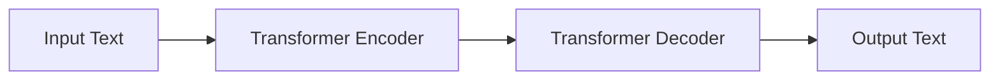

# Lab 11: Introduction to Large Language Models (LLMs)

---

# Overview

In this lab, we will explore the capabilities of large language models (LLMs) and how they can be used to generate text. Recently, LLMs have gained popularity due to their ability to generate human-like text and perform well on a variety of natural language processing tasks. Generative Pre-trained Transformer 2 (GPT-2) is one such LLM developed by OpenAI that has been widely used for text generation tasks. We will use the Hugging Face Transformers library to interact with the GPT-2 model and generate text based on a given prompt. After that, we will try to fine tune the GPT-2 model on a custom dataset to generate text that is specific to the domain of the dataset.

## Prerequisites

Before starting this lab, you should be familiar with the following:

- Python programming
- Natural language processing
- Transformers and transformer-based models
- PyTorch

## Learning Objectives

By the end of this lab, you will be able to:

- Use the Hugging Face Transformers library to generate text using the GPT-2 model
- Fine tune the GPT-2 model on a custom dataset

# Background

Large language models (LLMs) are a type of artificial intelligence model that can generate human-like text based on a given prompt. These models are trained on large amounts of text data and learn to predict the next word in a sequence of words. They are based on transformer architecture, which allows them to capture long-range dependencies in the text. One of the most popular LLMs is Generative Pre-trained Transformer 2 (GPT-2), developed by OpenAI.

## Transformers and Transformer-based Models

Transformers are a type of neural network architecture that has been widely used in natural language processing tasks. They are based on the self-attention mechanism, which allows them to capture long-range dependencies in the text. Transformer-based models, such as GPT-2, BERT, and RoBERTa, have achieved state-of-the-art performance on a variety of natural language processing tasks, including text generation, question answering, and sentiment analysis.



Transformers consist of an encoder-decoder architecture, where the encoder processes the input text and the decoder generates the output text. The encoder contains multiple layers of transformer blocks, each consisting of multi-head self-attention and feedforward neural network layers. The decoder also contains multiple layers of transformer blocks, but it additionally includes a cross-attention mechanism that allows it to attend to the encoder's output.

## GPT-2

Generative Pre-trained Transformer 2 (GPT-2) is a large language model developed by OpenAI. It is based on the transformer architecture and has been pre-trained on a large corpus of text data. GPT-2 can generate coherent and contextually relevant text based on a given prompt. It has been widely used for text generation tasks, such as story generation, dialogue generation, and code completion. The architecture of GPT-2 consists of a stack of transformer blocks, each containing multi-head self-attention and feedforward neural network layers.

There various versions of GPT-2 with different sizes, consisting of small (`gpt2`), medium (`gpt2-medium`), large (`gpt2-large`) and extra-large (`gpt2-xl`). The smallest model requires only 2GB of GPU memory for training, while the largest model requires 16GB of GPU memory for training. The larger models have more parameters and can generate more complex and diverse text. In this lab, we will use the smallest GPT-2 model with 124M parameters.

# Getting Started

To get started with this lab, let create a new jupyter notebook file.

## Install Required Libraries

You will need to install the Hugging Face Transformers library and download the GPT-2 model. You can install the library using `pip` and download the GPT-2 model using the `transformers` library.

```jupyter
!pip install -U datasets huggingface-hub transformers
```

## Declare parameters

Let's declare the parameters that we will use in this lab.

```python
import torch

model_id = 'gpt2'
device = 'cuda' if torch.cuda.is_available() else 'cpu'
```


## Loading the pre-trained GPT-2 model with `pipeline`

Let's load the pre-trained GPT-2 model using `pipeline` from the `transformers` library.

```python
from transformers import pipeline, set_seed

generator = pipeline('text-generation', model=model_id, device=device)
set_seed(42)
```

## Model architecture

To get an overview of the model architecture, we can print the model summary.

```python
generator.model
```

It will display the model architecture, including the number of parameters in each layer. For model configuration, we can print the model configuration.

```python
generator.model.config
```

## Generate Text

Now, we can generate text using the pre-trained GPT-2 model by providing a prompt.

```python
prompt = "Once upon a time"
output = generator(prompt, max_length=100, num_return_sequences=5)
for i, text in enumerate(output):
    print(f"Generated Text {i+1}: {text['generated_text']}\n")
```

Let's try to generate code snippets using the GPT-2 model by providing a code prompt.

```python
prompt = "def sum(a, b):"
output = generator(prompt, max_length=100, num_return_sequences=5)
for i, text in enumerate(output):
    print(f"Generated Code Snippet {i+1}: {text['generated_text']}\n")
```

# Case Study: Fine-tuning GPT-2 on a Custom Dataset

In this case study, we will fine-tune the GPT-2 model on a custom dataset to generate text that is specific to the domain of the dataset. Fine-tuning a pre-trained language model on a custom dataset allows the model to learn domain-specific patterns and generate text that is relevant to the domain.

## Declare Parameters

Let's declare the parameters that we will use in this case study.

```python
BATCH_SIZE = 8 # Change this value based on your GPU memory
EPOCHS = 5 # Change this value based on the number of epochs you want to train
LEARNING_RATE = 3e-5 # Change this value based on the learning rate you want to use
WARMUP_STEPS = 500 # Change this value based on the number of warmup steps you want to use
MAX_SEQ_LEN = 128 # Change this value based on the maximum sequence length you want to use

model = generator.model # Use the pre-trained GPT-2 model directly
```

## Tokenizer

We will use the GPT-2 tokenizer to encode the text data into tokens that can be fed into the model.

```python
from transformers import GPT2Tokenizer

tokenizer = GPT2Tokenizer.from_pretrained(model_id)
tokenizer.pad_token = tokenizer.eos_token
```

## Dataset

For this case study, we will use a dataset of Github code snippets. The dataset contains code snippets from various programming languages, such as Python, Java, and JavaScript. We will fine-tune the GPT-2 model on this dataset to generate code snippets based on a given prompt.

To download the dataset, you can use the `datasets` library.

```python
from datasets import load_dataset
from torch.utils.data import DataLoader

ds = load_dataset("codeparrot/github-code-clean", split="train", filter_languages=True, languages=["Python"], trust_remote_code=True, streaming=True)
train_loader = DataLoader(ds.with_format("torch"), batch_size=BATCH_SIZE, num_workers=8)
```

In the above code snippet, we load the dataset using the `load_dataset` function from the `datasets` library. We filter the dataset to include only Python code snippets and enable remote code execution for the dataset. The dataset will stream the data in batches parallelly using the `DataLoader` class from PyTorch when `streaming=True`.

## Optimizer and Scheduler

We will use the AdamW optimizer and the linear learning rate scheduler for fine-tuning the GPT-2 model.

```python
from transformers import AdamW, get_linear_schedule_with_warmup

optimizer = AdamW(model.parameters(), lr=LEARNING_RATE)
scheduler = get_linear_schedule_with_warmup(optimizer, num_warmup_steps=WARMUP_STEPS, num_training_steps = -1)
```

## The training loop

Now, we can define the training loop to fine-tune the GPT-2 model on the custom dataset.

```python
from tqdm import tqdm
import os

# Enable parallel tokenization, since we are using DataLoader with multiple workers
os.environ["TOKENIZERS_PARALLELISM"] = "true"

model.train()

for epoch in range(EPOCHS):
    loop = tqdm(train_loader, leave=True)

    running_loss = 0.0

    for d in loop:
        ids = tokenizer.encode(d['code'], max_length=MAX_SEQ_LEN, truncation=True, padding='max_length', return_tensors='pt')
        outputs = model(ids.to(device), labels=ids.to(device))
        loss, logits = outputs[:2]
        loss.backward()
        optimizer.step()
        scheduler.step()
        optimizer.zero_grad()
        
        running_loss += loss.detach().data

        loop.set_postfix(epoch=f"{epoch+1}/{EPOCHS}", loss=f"{running_loss:.4f}")
```

## Generate Text

After fine-tuning the GPT-2 model on the custom dataset, we can generate code snippets based on a given prompt.

```python
model.eval()
generator.model = model

prompt = "def sum(a, b):"
output = generator(prompt, max_length=100, num_return_sequences=5)
for i, text in enumerate(output):
    print(f"Generated Code Snippet {i+1}: {text['generated_text']}\n")
```

# Exploretory Exercises

Let's try to fine-tune the GPT-2 model on Harry Potter books dataset and generate text based on a given prompt. You could download the data from the following link and combine them into a single dataset with your custom Dataset and DataLoader.

- [https://github.com/gastonstat/harry-potter-data](https://github.com/gastonstat/harry-potter-data)
- [https://nuochenpku.github.io/HPD.github.io/download](https://nuochenpku.github.io/HPD.github.io/download)
