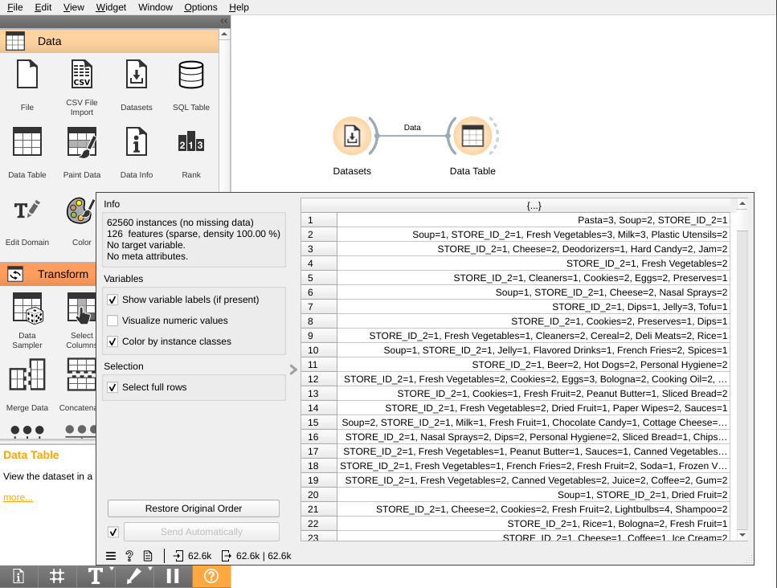

# Lab 2: Data Mining - Frequent Itemset Mining and Association Rule Mining

---

# Overview

In this lab, we first have a brief introduction to data mining, the tools and the dataset. Then we will use Orange3 with Python script to perform data mining tasks, like association rule mining and mining frequent itemsets.

## Background

Data mining is the process of discovering patterns in large data sets involving methods at the intersection of machine learning, statistics, and database systems. It is an essential process where intelligent methods are applied to extract data patterns. It is an interdisciplinary subfield of computer science.

The overall goal of the data mining process is to extract information from a data set and transform it into an understandable structure for further use. Aside from the raw analysis step, it involves database and data management aspects, data pre-processing, model and inference considerations, interestingness metrics, complexity considerations, post-processing of discovered structures, visualization, and online updating. Data mining is the analysis step of the "knowledge discovery in databases" process (KDD).

## Data Mining Tools in the Market

There are many data mining tools available in the market today. Some of them are free and open-source, while others are proprietary and commercial. Those tools could be used for data mining, machine learning, and data visualization without or with only minimal programming knowledge. They are used for business and commercial applications as well as for research, education, training, rapid prototyping, and application development and supports all steps of the machine learning process including data preparation, results visualization, model validation, and optimization

Let's take a look to some of the most popular data mining tools listed below.

### [Orange](https://orange.biolab.si/)


Orange is a component-based data mining and machine learning software suite written in the Python programming language. It features a visual programming front-end for explorative rapid qualitative data analysis and interactive data visualization. It allows users to create data analysis workflows, assemble and run them, and visualize the obtained data and intermediate results cooperatively with Python code. Orange is free software released under the terms of the GNU General Public License. Orange is cross-platform and works on Windows, macOS, and Linux. It can be installed in a Python virtual environment via pip package manager or conda package and environment manager.


### [RapidMiner](https://rapidminer.com/)


RapidMiner is a data science software platform developed by the company of the same name that provides an integrated environment for data preparation, machine learning, deep learning, text mining, and predictive analytics. It is used for business and commercial applications as well as for research, education, training, rapid prototyping, and application development and supports all steps of the machine learning process including data preparation, results visualization, model validation, and optimization.

### [Weka](https://www.cs.waikato.ac.nz/ml/weka/)


Weka is a Java based tools and collection of machine learning algorithms for data mining tasks. It contains tools for data preparation, classification, regression, clustering, association rules mining, and visualization. Found only on the islands of New Zealand, the Weka is a flightless bird with an inquisitive nature. The name is pronounced like this, and the bird sounds like this. Weka is open-source software issued under the GNU General Public License.

### [KNIME](https://www.knime.com/)


KNIME is a free and open-source data analytics, reporting, and integration platform. KNIME integrates various components for machine learning and data mining through its modular data pipelining concept. A graphical user interface and use of JDBC allows assembly of nodes blending different data sources, including preprocessing (ETL: Extraction, Transformation, Loading), for modeling, data analysis, and visualization without, or with only minimal, programming. To some extent as advanced analytics tool KNIME can be considered as a SAS alternative.

---

# Data Mining with Orange3

As Python is the most popular programming language for data science, we will be using Orange3 for data mining in this lab. By combining the flexibility of Python with the power of Orange and its rich ecosystem of add-ons, using Orange3 for data mining is a great choice for beginners and experienced data scientists alike and is free and open-source software released under the terms of the GNU General Public License (GPLv3) with a dual license model that allows for the software to be used for free for non-commercial purposes, while requiring a license for commercial purposes and for the development of add-ons.

Let's move on to the data mining part of this lab. We will first get familiar with Orange3 and then we will load the dataset into Orange3 and perform some data mining tasks, like association rule mining and mining frequent itemsets.

## Installation

Orange a free software released under the terms of the GNU General Public License. Orange is cross-platform and works on Windows, macOS, and Linux. It can be installed in a **Python virtual environment** via `pip` package manager or `conda` package and environment manager.

```bash
pip install -U Orange3
```

After that, we can run Orange3 with following command.

```bash
orange-canvas
```

## Getting Started 

Let's start by opening Orange3 and creating a new workflow. Please open Orange3 and create a new workflow with `File` -> `New` -> `Workflow` or `Ctrl + N`, or simply click the `New` button on the Welcome screen.


## Loading Data in Orange3

Orange3 can load data from a variety of sources, including CSV files, Excel files, SQL databases, and online data sources. We will be using the `Datasets` widget to load the dataset from web into Orange3.


Please search for `Foodmart` in the widget panel and double-click to load it into Orange3.

## Viewing Data in Orange3

Orange3 can display data in a variety of ways, including tables, scatter plots, and bar charts. We will be using the `Data Table` widget to view the dataset in Orange3.



Please connect the `Datasets` widget to the `Data Table` widget and run the workflow to generate above output.

## Filtering Data in Orange3

Orange3 can filter data in a variety of ways, including selecting columns, selecting rows, and selecting values. We will be using the `Select Rows` widget to filter the dataset in Orange3.

Please connect the `Data Table` widget to the `Select Rows` widget, we will need to configure the connection to send all data to the `Select Rows` widget for filtering. Please double-click the connection and connect `Data` to `Data`, instead of `Selected Data` to `Data`.


After that, we will need to configure the `Select Rows` widget to select transaction with `Milk`. Please double-click the `Select Rows` widget and configure it to select rows with `Milk` greater than `0`.


You may connect the `Select Rows` widget to the `Data Table` widget to view the filtered dataset.


# Frequent Itemset Mining and Association Rule Mining

Frequent itemset mining is a data mining task to find frequent itemsets and association rules in a transaction database. It identifies the frequent individual items in a database and extends them to larger itemsets. The frequent itemsets determined by frequent itemset mining can be used to determine association rules which highlight general trends in the database. These rules can be used to identify products that are frequently bought together. For example, people who buy bread and eggs also tend to buy butter as well. Frequent itemset mining is usually used to mine association rules.

## Install Orange3-Associate

Orange3-Associate is an add-on for Orange3 that provides a widget for frequent itemset mining and association rule mining. It is available on top menu bar `Options` > `Add-ons` > `Filter...`. Search with `Associate`, check it and click on `Install`.


It can also be installed with following command.

```bash
pip install Orange3-Associate
```

## Frequent Itemset Mining with Orange3-Associate

We will be using the `Frequent Itemsets` widget to mine frequent itemsets. Please connect the previous `Datasets` widget with `Foodmart` data to the `Frequent Itemsets` widget, and configure the widget to mine frequent itemsets with a minimum support of `0.1`. After clicking on ``, the widget will output the most frequent itemsets with a minimum support of `0.1`.

Minimum support is the minimum number of transactions that include an itemset. For example, the minimum support of `0.1` means that the itemset must appear in at least `10%` of the transactions.


You may also filter the frequent itemsets with a keyword like `Milk` to find the frequent itemsets with `Milk`.

## Association Rule Mining with Orange3-Associate

We will be using the `Association Rules` widget to mine association rules. Please connect the previous `Datasets` widget with `Foodmart` data to the `Association Rules` widget, and configure the widget to mine association rules with a minimum support of `0.01` and a minimum confidence of `90%`. After clicking on `Find Items`, the widget will output the association rules with a minimum support of `0.01` and a minimum confidence of `90%`.

Confidence is the ratio of the number of transactions that include all items in the consequent as well as the antecedent over the number of transactions that include all items in the antecedent. For example, the confidence of the association rule `Milk -> Butter` is `0.9`, which means that `90%` of the transactions that include `Milk` also include `Butter`.


Antecedent is the itemset on the left side of the arrow, and consequent is the itemset on the right side of the arrow. For example, the association rule `Milk -> Butter` means that people who buy `Milk` also tend to buy `Butter`.

# Case Study: Amazon Review Data (2018)

Amazon review data (2018) is a large collection of reviews and metadata from Amazon products. The dataset contains 233.1 million reviews spanning May 1996 - Oct 2018. It contains reviews and metadata from Amazon, including 142.8 million reviews spanning May 1996 - July 2014 for various products like books, electronics, movies, etc. This dataset is a slightly cleaned-up version of the data available at [https://cseweb.ucsd.edu/~jmcauley/datasets/amazon_v2/](https://cseweb.ucsd.edu/~jmcauley/datasets/amazon_v2/). The dataset is available in json format. We will be using the [`All_Beauty_5.json.gz`](https://datarepo.eng.ucsd.edu/mcauley_group/data/amazon_v2/categoryFilesSmall/All_Beauty_5.json.gz) file.

Let's take a look at the dataset.

```json
{
  "reviewerID": "A2SUAM1J3GNN3B",
  "asin": "0000013714",
  "reviewerName": "J. McDonald",
  "helpful": [2, 3],
  "reviewText": "I bought this for my husband who plays the piano. He is having a wonderful time playing these old hymns. The music is at times hard to read because we think the book was published for singing from more than playing from. Great purchase though!",
  "overall": 5.0,
  "summary": "Heavenly Highway Hymns",
  "unixReviewTime": 1252800000,
  "reviewTime": "09 13, 2009"
}
```

Since we are interested in mining frequent itemsets and association rules, we will only need the `reviewerID` and `asin` fields. The `reviewerID` field is the ID of the reviewer and the `asin` field is the ID of the product. We will be using these two fields to mine frequent itemsets and association rules.

## Data scraping with Python script

After knowing the dataset, we will download the dataset from web and load it into Orange3 with Python Script. We will be using the `Python Script` widget to load the dataset from web into Orange3.

### Python Script Widget

Python Script widget allows you to run Python scripts from within Orange. It can be used to load the dataset from web into Orange3. We could create a new script with `+` button and edit the script in the widget. The script can be run by clicking the `Run Script` button. The script can be saved by clicking the `Save Script` button.


A script is an actual Python function named `python_script`. It could accept input with a widget connected to the input of the Python Script widget. In that case, there would be one argument to the function named `in_data`. It's a data table of type [`Orange.data.Table`](https://orange3.readthedocs.io/projects/orange-data-mining-library/en/latest/reference/data.table.html).


It could output data with a widget connected to the output of the Python Script widget. The output consists of a dictionary with keys `out_data`, `out_learner`, `outout_classifier` and `out_object`.

- `out_data` is a data table of type [`Orange.data.Table`](https://orange3.readthedocs.io/projects/orange-data-mining-library/en/latest/reference/data.table.html)
- `out_learner` is a learner of type [`Orange.classification.Learner`](https://orange3.readthedocs.io/projects/orange-data-mining-library/en/latest/reference/classification.html)
- `out_classifier` is a classifier of type [`Orange.classification.Classifier`](https://orange3.readthedocs.io/projects/orange-data-mining-library/en/latest/reference/classification.html)
- `out_object` is an arbitrary Python object, that allow you to pass any data to other widgets

### Loading the Review Dataset from URL into Orange3

We will need a Python Script widget to load the dataset from web into Orange3. Please create a new Python Script widget with following code.

```python
from Orange.data import Table
import gzip
import json
import requests
import pandas as pd

json_url = 'https://datarepo.eng.ucsd.edu/mcauley_group/data/amazon_v2/metaFiles2/meta_All_Beauty.json.gz'

def download_file(url):
    local_filename = url.split('/')[-1]
    with requests.get(url, stream=True) as r:
        r.raise_for_status()
        with open(local_filename, 'wb') as f:
            for chunk in r.iter_content(chunk_size=8192):
                f.write(chunk)
    return local_filename


download_file(json_url)


df = pd.DataFrame()
with gzip.open(json_url.split('/')[-1], 'rb') as f:
    itemset = set()
    for line in f:
        record = json.loads(line)
        row = pd.DataFrame([{
            'reviewerID': record['reviewerID'],
            'asin': record['asin'],
        }])
        df = pd.concat([df, row], ignore_index=True)

def export(x):
    with open('output.basket', 'a+b') as f:
        dataline = f"{df.at[x.index[0], 'reviewerID']}=1, {'=1,'.join(x.tolist())}=1\n"
        f.write(dataline.encode('utf-8'))
    return ','.join(x.tolist())

df.groupby(by='reviewerID').agg(export)

out_data = Table.from_file('output.basket')
```

In above code, we download the top-5 most reviewed products [`All_Beauty_5.json.gz`](https://datarepo.eng.ucsd.edu/mcauley_group/data/amazon_v2/categoryFilesSmall/All_Beauty_5.json.gz) file by the `download_file` function. This function we have used in the previous lab. We then open the gzipped file and parse the json file line by line. We then extract the `reviewerID` and `asin` fields from the json file and store them in a Pandas `DataFrame`.

After that, we load the dataset into a Pandas DataFrame and export it to a file named `output.basket`. The dataset file format is in the basket format. Here is an example of the previous `Foodmart` dataset from [https://datasets.biolab.si/core/foodmart.basket](https://datasets.biolab.si/core/foodmart.basket). 

```csv
Fresh Vegetables=3, Milk=3, Plastic Utensils=2, Soup, STORE_ID_2
Cheese=2, Deodorizers, Hard Candy=2, Jam=2, STORE_ID_2
Fresh Vegetables=2, STORE_ID_2
Cleaners, Cookies=2, Eggs=2, Preserves, STORE_ID_2
Cheese=2, Nasal Sprays=2, Soup, STORE_ID_2
Dips, Jelly=3, Tofu, STORE_ID_2
Cookies=2, Dips, Preserves, STORE_ID_2
Cereal=2, Cleaners=2, Deli Meats=2, Fresh Vegetables, Rice, STORE_ID_2
Flavored Drinks, French Fries=2, Jelly, Soup, Spices, STORE_ID_2
```

The basket format is a text file with one transaction per line. Each transaction is a list of items separated by commas. The first item in each transaction is the transaction ID. The rest of the items are the items in the transaction. The items are separated by commas. The transaction ID and the items are separated by `=`. The `output.basket` file is the input of the `Frequent Itemsets` widget and the `Association Rules` widget.

## Exercise: Frequent Itemset and Association Rule

### Find the most frequent itemsets with a minimum support of 0.05

Please configure the `Frequent Itemsets` widget to find the most frequent itemsets with a minimum support of 0.05. The widget will output the most frequent itemsets with a minimum support of 0.05.

### Find the association rules with a minimum support of 0.01 and a minimum confidence of 90%

Please configure the `Association Rules` widget to find the association rules with a minimum support of 0.01 and a minimum confidence of 90%. The widget will output the association rules with a minimum support of 0.01 and a minimum confidence of 90%.

## Download products metadata

In order to interpret the frequent itemsets and association rules, we will need to download the products metadata from web. We will be using the `Python Script` widget to download the products metadata from web into Orange3.

# Exercise: Frequent itemset and association rule mining for another category in Amazon review data

Please try to apply what we have learn in today's lab to another category in Amazon review data (2018) and try to interpret the result.