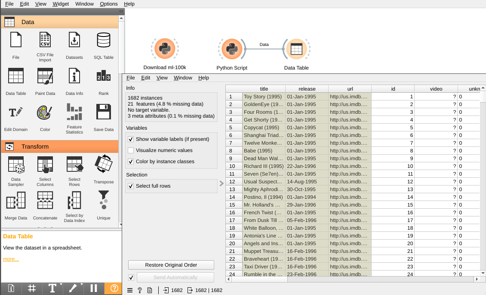

# Lab 3: Data Mining - Similarity Matching

---

# Overview

In this lab, you will learn how to use Orange3 to find similar movies in the MovieLens dataset. You will also learn how to convert a dataset into a format that can be used by the similarity matching widget.

## Background

Similarity Matching is a technique used to find similar items in a dataset. It is used in many applications such as finding similar documents, finding similar images, finding similar products, etc. In this lab, you will learn how to use similarity matching to find similar items in a dataset. You will also learn how to convert a dataset into a format that can be used by the similarity matching algorithms.

The key idea behind similarity matching is that similar items are close to each other in the dataset. Therefore, we can use the distance between two items to measure their similarity. The smaller the distance, the more similar the two items are. There are many different distance metrics and similarity measures. The most commonly used distance metrics are Euclidean distance and Manhattan distance. The most commonly used similarity measures are cosine similarity and Pearson correlation.


A typical usage for similarity matching is in recommendation systems. For example, if you are watching a movie on Netflix, Netflix will recommend other movies that are similar to the one you are watching. In this lab, you will use similarity matching to find similar movies in the MovieLens dataset.

## Learning Objectives

After completing this lab, you should be able to:

- Use similarity matching to find similar items in a dataset.
- Convert a dataset into a format that can be used by the similarity matching algorithms.
- Use different distance metrics and similarity measures to find similar items in a dataset.
- Use similarity matching to find similar movies in the MovieLens dataset.
- Use Orange3 to find similar movies in the MovieLens dataset.

# Case Study: Movie Recommendation

In this lab, you will use similarity matching to find similar movies in the MovieLens dataset. Let's take a look at the MovieLens 100k dataset README on [https://files.grouplens.org/datasets/movielens/ml-100k-README.txt](https://files.grouplens.org/datasets/movielens/ml-100k-README.txt).


The MovieLens dataset contains 100,000 ratings from 943 users on 1,682 movies. The dataset can be downloaded from [here](https://files.grouplens.org/datasets/movielens/ml-100k.zip). The dataset contains the following files:

- `u.data`: The full dataset in tab separated format, 100,000 ratings by 943 users on 1,682 movies.
- `u.info`: The number of users, items, and ratings in the dataset.
- `u.item`: Information about the 1,682 movies. This is a pipe separated list of:
  - movie id
  - movie title
  - release date
  - video release date
  - IMDb URL
  - unknown
  - Action
  - Adventure
  - Animation
  - Children's
  - Comedy
  - Crime
  - Documentary
  - Drama
  - Fantasy
  - Film-Noir
  - Horror
  - Musical
  - Mystery
  - Romance
  - Sci-Fi
  - Thriller
  - War
  - Western
- `u.genre`: A list of the genres.
- `u.user`: Demographic information about the users. This is a tab separated list of:
  - user id
  - age
  - gender
  - occupation
  - zip code
- `u.occupation`: A list of the occupations.

## Download and extract the Dataset

Let's download the dataset and extract it with `Python script` widget in Orange3. Please create a new workflow and add a `Python script` widget. Then, copy and paste the following code into the `Python script` widget.

```python
import requests
from zipfile import ZipFile 

zip_url = 'https://files.grouplens.org/datasets/movielens/ml-100k.zip'

def download_file(url):
    local_filename = url.split('/')[-1]
    with requests.get(url, stream=True) as r:
        r.raise_for_status()
        with open(local_filename, 'wb') as f:
            for chunk in r.iter_content(chunk_size=8192):
                f.write(chunk)
    return local_filename

download_file(zip_url)
filename = zip_url.split('/')[-1]

with ZipFile(filename, 'r') as zipObj:
   zipObj.extractall()

```

The above script will download the dataset and extract it in the current directory. You can check the current directory by clicking on the `File` menu and select `Open Folder`. You should see the `ml-100k` folder in the current directory.

## Load the Dataset

After download and extracted the dataset, let's load the dataset into Orange3. Please add a `Python script` widget with the following code. Then add a `Data Table` widget and connect the `Python script` widget to the `Data Table` widget.

```python
from Orange.data import Domain, DiscreteVariable, Table, StringVariable
import pandas as pd

filename = 'ml-100k/u.item'

tags = [
    'unknown',
    'Action',
    'Adventure',
    'Animation',
    "Children's",
    'Comedy',
    'Crime',
    'Documentary',
    'Drama',
    'Fantasy',
    'Film-Noir',
    'Horror',
    'Musical',
    'Mystery',
    'Romance',
    'Sci-Fi',
    'Thriller',
    'War',
    'Western'
]

columns = [
    'id',
    'title',
    'release',
    'video',
    'url',
]

domain = Domain([DiscreteVariable.make(t) for t in tags],
                metas=[StringVariable(c) for c in columns])
df = pd.DataFrame(columns=columns+tags)

with open(filename, 'rb') as f:
    for i, line in enumerate(f):
        df.loc[i] = line.decode("ISO-8859-1").strip().split('|')

df[tags] = df[tags].astype(str)
df[columns] = df[columns].astype(str)

for i, m in enumerate(['Jan', 'Feb', 'Mar', 'Apr', 'May', 'Jun', 'Jul', 'Aug', 'Sep', 'Oct', 'Nov', 'Dec']):
  if i < 9:
    df['release'] = df['release'].str.replace(m, '0'+str(i+1))
  else:
    df['release'] = df['release'].str.replace(m, str(i+1))
df['release'] = df['release'].str.replace('-','/')

df.to_csv('u.item.csv', index=False)
out_data = Table.from_file('u.item.csv')
```

The above script will load the `u.item` file in `ml-100k` folder into Orange3 as `Table` and see the following output in the `Data Table` widget. We also do data cleaning in the above script. For example, we convert the release date to the format `MM/DD/YYYY` which could be recognized by Orange3.



*Remarks:*
- The date format from the script is `DD/MM/YYYY` instead of `MM/DD/YYYY` when I run the script. But the `Edit Domain` widget will recognize the date format as `MM/DD/YYYY` only

## Data preprocessing

The `release` column contains the release date of the movie. It could be converted to a `Date` column using the `Edit Domain` widget. Please add an `Edit Domain` widget and connect the `Data Table` widget to the `Edit Domain` widget. Then, click on the `Edit Domain` widget and select the `release` column. Then, change the `Type` to `Time` and click on the `Apply` button. It would also generate a new column `Selected` with `Yes` and `No` values.

*Remarks:*
- No `Selected` column is generated


The `Selected` column is generated by the `Edit Domain` widget. It's not useful for finding similar movies. Thus, we will remove this column using the `Select Columns` widget.


Please add a `Select Columns` widget and connect the `Edit Domain` widget to the `Select Columns` widget. Then, click on the `Select Columns` widget and select the columns you want to keep. In this case, we will keep all columns except `Selected` column.

## Calculate the distance

In order to measure the similarity between two movies, we need to calculate the distance between two movies. To calculate the distance between two movies, please add a `Distance` widget and connect the `Select Columns` widget to the `Distance` widget. The `Distance` widget will calculate the distance between movies. Each row in the dataset represents a movie and each column in the dataset represents a feature of the movie. Thus, we select compare rows in the widget settings.


The `Distance` widget will calculate the distance using categorical and numeric features only. All metadata will be ignored. But those metadata could be used to identify data in the resulting visualization.

### Euclidean distance

The default distance function for `Distance` widget is [Euclidean distance](https://en.wikipedia.org/wiki/Euclidean_distance) width values normalized. The Euclidean distance is defined as follows:


The Euclidean distance is the square root of the sum of the squared differences between two vectors, and it's the most commonly used distance metric.

### Manhattan distance

The Manhattan distance is the sum of the absolute differences between two vectors. It's also known as the city block distance or the [taxicab distance](https://en.wikipedia.org/wiki/Taxicab_geometry). The Manhattan distance is defined as follows:


Let's add another `Distance` widget and change the distance function to `Manhattan`. Then, connect the `Select Columns` widget to the `Distance` widget. It will calculate the Manhattan distance between movies.


### Jaccard distance

The [Jaccard](https://en.wikipedia.org/wiki/Jaccard_index) distance is a distance metric used for comparing the similarity and diversity of sample sets. The Jaccard distance is defined as follows:


Let's add another `Distance` widget and change the distance function to `Jaccard`. Then, connect the `Select Columns` widget to the `Distance` widget. It will calculate the Jaccard distance between movies.


## Visualize the result

Let's take a look how we could visualize the result in Orange3. Orange3 provides many widgets for visualizing the result. For example, we could use the `Distance Matrix` widget to visualize the distance between movies. We could also use the `Distance Map` widget to visualize the distance between movies in a 2D map.

### Distance Matrix

We could use the `Distance Matrix` widget to visualize the distance between movies. Please add three `Distance Matrix` widgets and connect each `Distance` widget.


#### Euclidean distance

The interpretation is the square root of the sum of the squared differences between two vectors.

#### Manhattan distance

The interpretation is the sum of the absolute differences between two vectors. So, a Manhattan distance of 10 means the sum of the absolute differences between two vectors is 10. Since we got 19 columns, the maximum distance is 19.

#### Jaccard distance

The interpretation is the percent of members found in both samples, and found in only one sample. So, a Jaccard Similarity of 0.3 means 30% of the members were found in both samples, and 70% where found in only one of the two samples.

### Distance Map

Distance Map is a widget that visualizes the distance between items in a 2D map. The distance between items is calculated using the distance function specified in the widget settings. Please add a `Distance Map` widget and connect the `Distance` widget to the `Distance Map` widget.


The `Distance Map` widget will visualize the distance between movies in a 2D map. The distance between movies is calculated using the corresponding distance function.

### Scatter Plot with Multidimensional Scaling

Another way to visualize the distance between movies is to use the `MDS` widget. The `MDS` widget allow us to visualize data in a scatter plot by apply [Multidimensional Scaling](https://en.wikipedia.org/wiki/Multidimensional_scaling) to the data. Please add three `MDS` widgets and connect to each `Distance` widget.


You will need to increase the jitter in the `MDS` widget settings to see the points in the scatter plot. You may mouse-over the points in the scatter plot to see the movie title. The `MDS` widget will visualize the distance between movies in a scatter plot. The distance between movies is calculated using the corresponding distance function.

# Exercise: Find similar products in the Amazon dataset

In this exercise, we will re-use the Amazon dataset from Lab 2. 