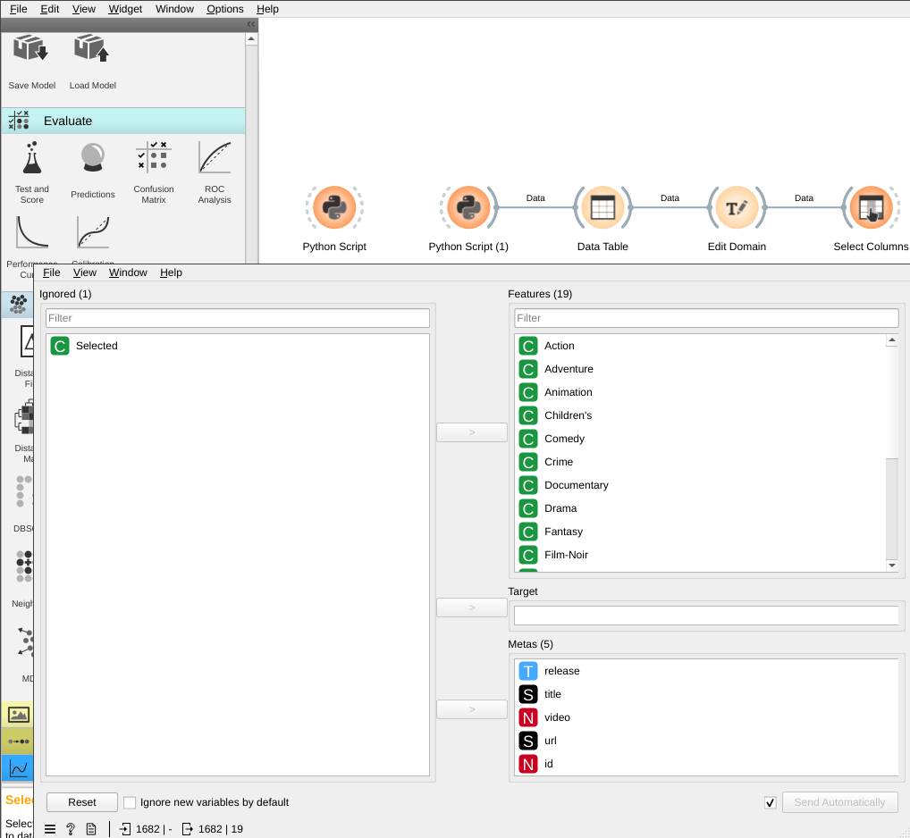

# Lab 3: Data Mining - Similarity Matching

---

# Overview

In this lab, you will learn how to use the similarity matching techniques to find similar items in a dataset. You will try out different distance metrics and similarity measures to find similar items in a dataset. To order to work with a real-world dataset, you will learn how to convert a dataset into a format that can be used by the similarity matching algorithms.

## Background

Similarity Matching is a technique used to find similar items in a dataset. It is used in many applications such as finding similar documents, finding similar images, finding similar products, etc. In this lab, you will learn how to use similarity matching to find similar items in a dataset. You will also learn how to convert a dataset into a format that can be used by the similarity matching algorithms.

The key idea behind similarity matching is that similar items are close to each other in the dataset. Therefore, we can use the distance between two items to measure their similarity. The smaller the distance, the more similar the two items are. There are many different distance metrics and similarity measures. The most commonly used distance metrics are Euclidean distance and Manhattan distance. The most commonly used similarity measures are cosine similarity and Pearson correlation.


A typical usage for similarity matching is in recommendation systems. For example, if you are watching a movie on Netflix, Netflix will recommend other movies that are similar to the one you are watching. In this lab, you will use similarity matching to find similar movies in the MovieLens dataset.

## Learning Objectives

After completing this lab, you should be able to:

- Use similarity matching to find similar items in a dataset.
- Convert a dataset into a format that can be used by the similarity matching algorithms.
- Use different distance metrics and similarity measures to find similar items in a dataset.
- Use similarity matching to find similar movies in the MovieLens dataset.
- Use Orange3 to find similar movies in the MovieLens dataset.

# Case Study: Movie Recommendation

In this lab, you will use similarity matching to find similar movies in the MovieLens dataset. Let's take a look at the MovieLens 100k dataset README on [https://files.grouplens.org/datasets/movielens/ml-100k-README.txt](files.grouplens.org/datasets/movielens/ml-100k-README.txt).

The MovieLens dataset contains 100,000 ratings from 943 users on 1,682 movies. The dataset can be downloaded from [here](https://files.grouplens.org/datasets/movielens/ml-100k.zip). The dataset contains the following files:

- `u.data`: The full dataset in tab separated format, 100,000 ratings by 943 users on 1,682 movies.
- `u.info`: The number of users, items, and ratings in the dataset.
- `u.item`: Information about the 1,682 movies. This is a pipe separated list of:
  - movie id
  - movie title
  - release date
  - video release date
  - IMDb URL
  - unknown
  - Action
  - Adventure
  - Animation
  - Children's
  - Comedy
  - Crime
  - Documentary
  - Drama
  - Fantasy
  - Film-Noir
  - Horror
  - Musical
  - Mystery
  - Romance
  - Sci-Fi
  - Thriller
  - War
  - Western
- `u.genre`: A list of the genres.
- `u.user`: Demographic information about the users. This is a tab separated list of:
  - user id
  - age
  - gender
  - occupation
  - zip code
- `u.occupation`: A list of the occupations.

## Download and extract the Dataset

Let's download the dataset and extract it with `Python script` widget in Orange3. Please create a new workflow and add a `Python script` widget. Then, copy and paste the following code into the `Python script` widget.

```python
import requests
from zipfile import ZipFile 

zip_url = 'https://files.grouplens.org/datasets/movielens/ml-100k.zip'

def download_file(url):
    local_filename = url.split('/')[-1]
    with requests.get(url, stream=True) as r:
        r.raise_for_status()
        with open(local_filename, 'wb') as f:
            for chunk in r.iter_content(chunk_size=8192):
                f.write(chunk)
    return local_filename

download_file(zip_url)
filename = zip_url.split('/')[-1]

with ZipFile(filename, 'r') as zipObj:
   zipObj.extractall()

```

The above script will download the dataset and extract it in the current directory. You can check the current directory by clicking on the `File` menu and select `Open Folder`. You should see the `ml-100k` folder in the current directory.

## Load the Dataset

After download and extracted the dataset, let's load the dataset into Orange3. Please add a `Python script` widget with the following code. Then add a `Data Table` widget and connect the `Python script` widget to the `Data Table` widget.

```python
from Orange.data import Domain, DiscreteVariable, Table, StringVariable
import pandas as pd

filename = 'ml-100k/u.item'

tags = [
    'unknown',
    'Action',
    'Adventure',
    'Animation',
    "Children's",
    'Comedy',
    'Crime',
    'Documentary',
    'Drama',
    'Fantasy',
    'Film-Noir',
    'Horror',
    'Musical',
    'Mystery',
    'Romance',
    'Sci-Fi',
    'Thriller',
    'War',
    'Western'
]

columns = [
    'id',
    'title',
    'release',
    'video',
    'url',
]

domain = Domain([DiscreteVariable.make(t) for t in tags],
                metas=[StringVariable(c) for c in columns])
df = pd.DataFrame(columns=columns+tags)

with open(filename, 'rb') as f:
    for i, line in enumerate(f):
        df.loc[i] = line.decode("ISO-8859-1").strip().split('|')

df[tags] = df[tags].astype(str)
df[columns] = df[columns].astype(str)

df.to_csv('u.item.csv', index=False)
out_data = Table.from_file('u.item.csv')
```

The above script will load the `u.item` file in `ml-100k` folder into Orange3 as `Table` and see the following output in the `Data Table` widget.


## Data preprocessing

Some of the columns in the dataset are not useful for finding similar movies. For example, the `id` column is just an identifier for the movie. The `title` column contains the title of the movie. The `release` column contains the release date of the movie. The `video` column contains the video release date of the movie. The `url` column contains the IMDb URL of the movie. These columns are not useful for finding similar movies. Therefore, we will remove these columns from the dataset.



The `Select Columns` widget will remove `id`, `title`, `release`, `video`, and `url` columns from the dataset and keep all other columns.

## Calculate the distance

To calculate the distance between two movies, we need to convert the dataset into a format that can be used by the similarity matching algorithms. The `Distance` widget will convert the dataset into a format that can be used by the similarity matching algorithms. The `Distance` widget will calculate the distance between  movies.


The default distance function is Euclidean distance with values normalized to the range [0, 1]. The Euclidean distance is the square root of the sum of the squared differences between two vectors. The Euclidean distance is the most commonly used distance metric. The Euclidean distance is defined as follows:


## Visualize the result

It's hard to visualize the distance between two movies. Therefore, we will use the `Distance Matrix` widget to visualize the distance between two movies. The `Distance Matrix` widget will calculate the distance between all pairs of movies and visualize the distance between two movies.


It will show all pairs of movies and the distance between movies in the dataset. We could also visualize the distance matrix using the `Distance Map` widget.

