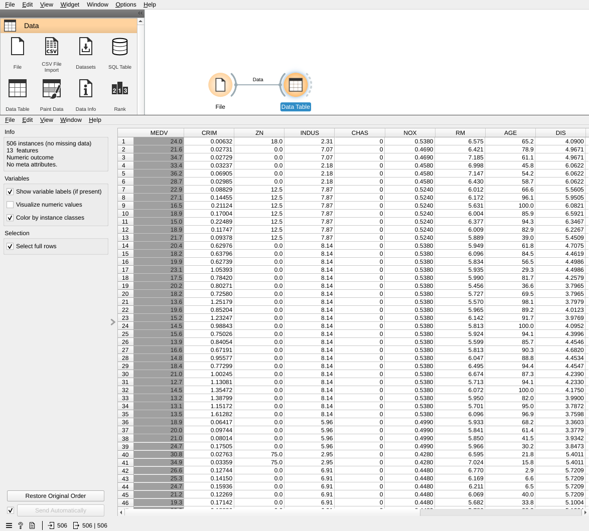
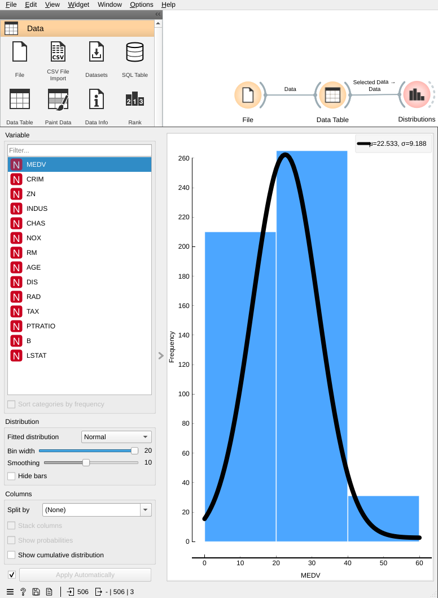
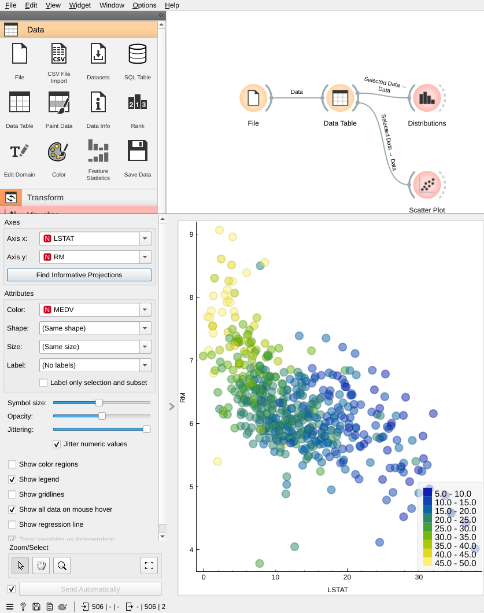
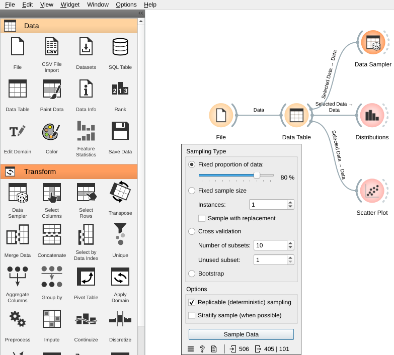
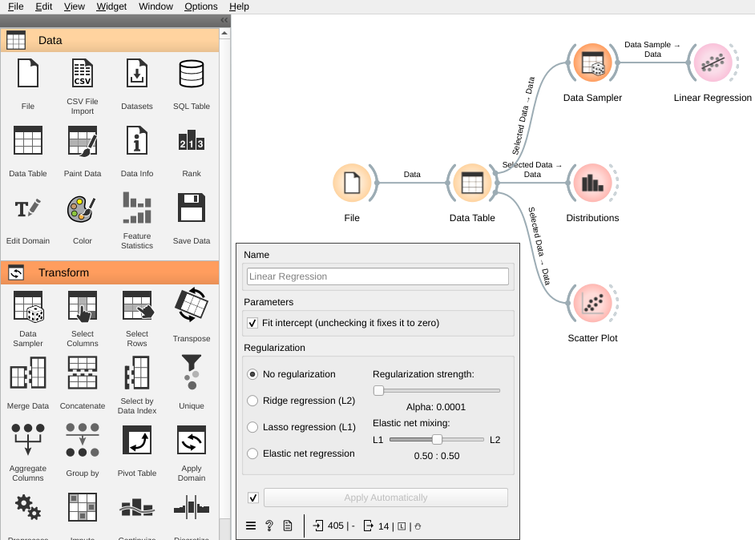
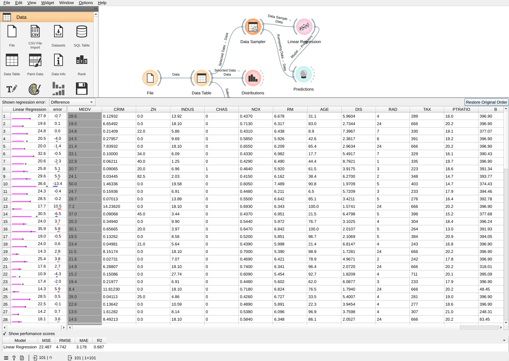

# Lab4: Regression
---

# Overview

In this lab, you will learn how to use Orange3 for regression problems. You will learn how to use different regression algorithms to predict the Boston house price. You will also learn how to evaluate the performance of a regression model.

## Introduction

In this lab, we will be using Orange3 to predict the house price. We will be using the Boston House Prices dataset. The Boston House Prices dataset is a real-world dataset that contains information collected by the U.S Census Service concerning housing in the area of Boston Mass during 1978.

Hose price prediction is a regression problem. It's a supervised learning problem. In supervised learning, we have a dataset that contains both the input and the output. The input is the independent variable and the output is the dependent variable. The goal of supervised learning is to learn a function that maps the input to the output. The function is called a model. The model is learned from the training dataset. The model is then used to predict the output for the unseen input.

This lab will cover the following topics:

- Linear Regression
- Ridge Regression (L1)
- Lasso Regression (L2)
- Elastic Net Regression (L1 + L2)

# Getting Started

Linear regression is a supervised learning algorithm that is used to predict the value of a continuous variable. Linear regression is a simple algorithm that is easy to understand and implement. Linear regression is often used as a baseline algorithm to compare the performance of more complex algorithms.

Please create a new workflow in Orange3.

## Generating synthetic data for experiments

Given a data set with pairs of input feature vector and output value(s), a regression model can be learned. There are different regression models that you can try, including linear regression, ridge Regression, etc.

Let us consider the simplest form of a linear regression model (i.e., fitting a straight line to one-dimensional input data). This simple model can be extended to model more complicated data behavior.

We will start with the most familiar linear regression, a straight-line fit to data. A straight-line fit is a model of the form


where `a` is commonly known as the slope, and `b` is commonly known as the intercept (also known as bias).

Consider the following data which is generated by scattering about a line with a slope of 2 and an intercept of -5 with some random fluctuations. We will use Orange to generate synthetic data for experiments. Orange provides a number of data generators that can be used to generate synthetic data for experiments. The following code snippet shows how to generate a dataset with 100 instances and 2 features using the `Python Script` widget:

```python
import numpy as np
from Orange.data import Table, Domain, ContinuousVariable, DiscreteVariable

domain = Domain([ContinuousVariable("x"),
                 ContinuousVariable("y")])

rng = np.random.RandomState(1)
x = 10 * rng.rand(50)          # randomly generated input x
y = 2 * x - 5 + rng.randn(50)  # use theta_1*x + theta_0 + noise to generated output y

arr = list(zip(x, y))
out_data = Table.from_numpy(domain, arr)
```

The code above creates a table with two columns: `x` and `y`.

## Transforming data to features and target

The first step in building a regression model is to transform the data into features and target. The features are the input variables that are used to predict the target variable. The target variable is the variable that we want to predict. In the case of linear regression, the features are the input variables and the target is the output variable.

Let's use the `Select Columns` widget to select the `x` and `y` columns as features and target, respectively. The `Select Columns` widget can be found in the `Data` category. The `Select Columns` widget allows users to select column by name or by index. The `Select Columns` widget outputs a data table with the selected columns.


## Visualizing data

Before building a regression model, it is a good idea to visualize the data. The `Scatter Plot` widget can be used to visualize the data. The `Scatter Plot` widget can be found in the `Visualize` category. The `Scatter Plot` widget displays a scatter plot of the input data. The `Scatter Plot` widget can be used to visualize the relationship between the input variables and the target variable.


## Apply linear regression

The `Linear Regression` widget can be found in the `Regression` category. The `Linear Regression` widget learns a linear regression model from the input data. The `Linear Regression` widget outputs a model that can be used to predict the target variable.

In order to see the result coefficients, we can connect the `Linear Regression` widget to the `Data Table` widget. The `Data Table` widget can be found in the `Data` category. The `Data Table` widget displays the input data in a tabular format. The `Data Table` widget can be used to inspect the input data and the output data.


## Drawing regression line on the scatter plot

To draw the regression line on the scatter plot, we can update the `Scatter Plot` widget to show the regression line. Please check the `Show regression line` checkbox in the `Scatter Plot` widget.


# Case Study: Boston House Prices

Let's start by introducing the Boston House Prices dataset. We will be using the Boston House Prices dataset to predict the house price to order to learn how to use Orange3 for regression problems.

## Dataset description

It's a real-world dataset that contains information collected by the U.S Census Service concerning housing in the area of Boston Mass during 1978. The dataset contains 506 instances and 14 attributes. The dataset contains the following attributes:

- `CRIM`: per capita crime rate by town
- `ZN`: proportion of residential land zoned for lots over 25,000 sq.ft.
- `INDUS`: proportion of non-retail business acres per town
- `CHAS`: Charles River dummy variable (= 1 if tract bounds river; 0 otherwise)
- `NOX`: nitric oxides concentration (parts per 10 million)
- `RM`: average number of rooms per dwelling
- `AGE`: proportion of owner-occupied units built prior to 1940
- `DIS`: weighted distances to five Boston employment centres
- `RAD`: index of accessibility to radial highways
- `TAX`: full-value property-tax rate per \$10,000
- `PTRATIO`: pupil-teacher ratio by town
- `MEDV`: Median value of owner-occupied homes in \$1000's

The following table shows the first 5 instances in the data set:

| CRIM    | ZN   | INDUS | CHAS | NOX   | RM    | AGE  | DIS    | RAD | TAX   | PTRATIO  | B      | LSTAT  | MEDV  |
|---------|------|-------|------|-------|-------|------|--------|-----|-------|----------|--------|--------|-------|
| 0.00632 | 18.0 | 2.31  | 0.0  | 0.538 | 6.575 | 65.2 | 4.0900 | 1.0 | 296.0 | 15.3     | 396.90 | 4.98   | 24.0  |
| 0.02731 | 0.0  | 7.07  | 0.0  | 0.469 | 6.421 | 78.9 | 4.9671 | 2.0 | 242.0 | 17.8     | 396.90 | 9.14   | 21.6  |
| 0.02729 | 0.0  | 7.07  | 0.0  | 0.469 | 7.185 | 61.1 | 4.9671 | 2.0 | 242.0 | 17.8     | 392.83 | 4.03   | 34.7  |
| 0.03237 | 0.0  | 2.18  | 0.0  | 0.458 | 6.998 | 45.8 | 6.0622 | 3.0 | 222.0 | 18.7     | 394.63 | 2.94   | 33.4  |
| 0.06905 | 0.0  | 2.18  | 0.0  | 0.458 | 7.147 | 54.2 | 6.0622 | 3.0 | 222.0 | 18.7     | 396.90 | 5.33   | 36.2  |

## Loading the dataset

Let's drag the `File` widget to the canvas. The `File` widget allows us to load a dataset from a file. Please select `housing.tab` file in the file dialog. The `File` widget will load the dataset from the file and output the dataset.


## Data Exploration

After loading a dataset, we usually want to explore the dataset. We want to know the number of instances and attributes in the dataset. We also want to know the data type of each attribute. We can use the `Data Table` widget to explore the dataset. The `Data Table` widget displays the dataset in a tabular format. It displays the number of instances and attributes in the dataset. It also displays the data type of each attribute.

Please connect the `File` widget to the `Data Table` widget. The `Data Table` widget will display the dataset in a tabular format. It displays the number of instances and attributes in the dataset. It also displays the data type of each attribute.



We may check `Visualize numeric values` to display the distribution of each attribute in a histogram. We may also check `Visualize categorical values` to display the distribution of each attribute in a bar chart.

### Distributions

We can use the `Distributions` widget to explore the distribution of each attribute. The `Distributions` widget displays the distribution of each attribute in the dataset. It displays the distribution of each attribute in a histogram. It also displays the mean and standard deviation of each attribute.

Please connect the `File` widget to the `Distributions` widget. The `Distributions` widget will display the distribution of each attribute in the dataset.

*Remarks:*
- only mean and standard deviation are shown



### Scatter Plot

We can use the `Scatter Plot` widget to explore the relationship between two attributes. The `Scatter Plot` widget displays the relationship between two attributes in a scatter plot. It displays the relationship between two attributes in a scatter plot. It also displays the correlation coefficient between two attributes.



Please connect the `File` widget to the `Scatter Plot` widget. The `Scatter Plot` widget will display the relationship between two attributes in a scatter plot. It displays the relationship between two attributes in a scatter plot. It also displays the correlation coefficient between two attributes.

You may click on `Find informative projections` to see which two attributes are the most informative. It will short all pairs in descending order of their mutual information.

## Data Preprocessing

After exploring the dataset, we usually want to preprocess the dataset. But for this dataset, we don't need to preprocess the dataset. The dataset is already clean. It doesn't contain any missing values. It doesn't contain any categorical attributes. All attributes are numeric attributes. All attributes are continuous attributes. All attributes are independent attributes. There is no dependent attribute.

### Train-Test Split

Before building a model, we usually want to split the dataset into training and testing datasets. We use the training dataset to build a model. We use the testing dataset to evaluate the performance of the model. We can use the `Data Sampler` widget to split the dataset into training and testing datasets. The `Data Sampler` widget can be found in the `Data` category. The `Data Sampler` widget splits the dataset into training and testing datasets. It outputs the training dataset and the testing dataset.



## Data Modeling

After preprocessing the dataset, we usually want to build a model. We want to learn a function that maps the input to the output. The function is called a model. The model is learned from the training dataset. The model is then used to predict the output for the unseen input.

### Linear Regression

We can use the `Linear Regression` widget to build a linear regression model. The `Linear Regression` widget builds a linear regression model. It learns a function that maps the input to the output. The function is called a model. The model is learned from the training dataset. The model is then used to predict the output for the unseen input.



## Make Predictions

After building a model, we usually want to use the model to make predictions. We can use the `Predictions` widget to make predictions. The `Predictions` widget can be found in the `Evaluate` category. The `Predictions` widget makes predictions using the model. Please connect `Data Sampler` widget to the `Data` of `Predictions` widget, and connect `Linear Regression` widget to the `Predictors` of `Predictions` widget. The `Predictions` widget outputs the predictions.



## Evaluate the model

After making predictions, we usually want to evaluate the performance of the model. We can use the `Test & Score` widget to evaluate the performance of the model. The `Test & Score` widget can be found in the `Evaluate` category. The `Test & Score` widget evaluates the performance of the model. It outputs the performance of the model.


### K-fold cross validation

Cross validation is a technique that is used to evaluate the performance of a model. Cross validation is used to estimate how well a model will perform on unseen data. Cross validation is used to reduce the risk of overfitting a model.

K-fold cross validation is a type of cross validation. K-fold cross validation is used to evaluate the performance of a model. K-fold cross validation is used to estimate how well a model will perform on unseen data. K-fold cross validation is used to reduce the risk of overfitting a model.


By default, the `Test & Score` widget uses 5-fold cross-validation to evaluate the performance of a model. The `Test & Score` widget outputs the performance of the model.

### Evaluation Metrics

There are different metrics that can be used to evaluate the performance of a regression model. The most common metrics are mean absolute error (MAE), mean squared error (MSE), root mean squared error (RMSE) and R2 score.

**MAE** is the average of the absolute differences between the predicted values and the actual values. MSE is the average of the squared differences between the predicted values and the actual values. RMSE is the square root of MSE. R2 score is the proportion of the variance in the dependent variable that is predictable from the independent variable(s).

**MSE** is the most commonly used metric for regression problems. However, it is difficult to interpret because it is not in the same unit as the target variable.

**RMSE** is the square root of MSE, and it is in the same unit as the target variable. Therefore, RMSE is easier to interpret than MSE.

**R2** score is a normalized version of MSE. R2 score is between 0 and 1. R2 score is 1 when the model perfectly predicts the target variable. R2 score is 0 when the model does not predict the target variable.

The following table shows the formulas for these metrics:

| Metric | Formula                                                                                                                                                                                                                                                    |
|--------|------------------------------------------------------------------------------------------------------------------------------------------------------------------------------------------------------------------------------------------------------------|
| MAE    |                                                                                                                                         |
| MSE    |                                                                                        |
| RMSE   |                                                                  |
| R2     | %5E2%7D%7B%5Csum_%7Bi%3D1%7D%5E%7Bn%7D(y_i-%5Cbar%7By%7D)%5E2%7D) |

# Exploratory Exercises: Traffic prediction of Major Roads in Hong Kong

In this exercise, you will learn how to use Orange3 to predict the traffic volume of major roads in Hong Kong. There are numerous vehicles speed detector installed on the major roads in Hong Kong. The detectors collect the real-time traffic speed, volume and road occupancy of major roads in Hong Kong. You may take a look to this [link](https://portal.csdi.gov.hk/geoportal/?datasetId=td_rcd_1671693191724_92214&lang=en) for detail location of the detectors and its ID.

We could predict the traffic volume of a particular road by using the traffic speed, road occupancy at the same time of another road. If the road is connected, their traffic data should be correlated. We could use the traffic data of one road to predict the traffic data of another road. Please try out a few detectors and see if the traffic data of one road can be used to predict the traffic data of another road.

## Dataset

The dataset we use is [Real-time Traffic Speed, Volume and Road Occupancy of Major roads](https://data.gov.hk/en-data/dataset/hk-td-sm_4-traffic-data-strategic-major-roads) from the Hong Kong government. It contains the real-time traffic speed, volume and road occupancy of major roads in Hong Kong. The dataset contains the following attributes:

- `date`: The date of the record
- `period_from`, `period_to`: The period of the record
- `detector_id`: The unique identifier of the detector
- `direction`: The direction of the traffic
- `lane_id`: The name of the lane
  - With 4 lanes, the lane names are `Fast Lane`, `Middle Lane 2`, `Middle Lane 1` and `Slow Lane`
  - With 3 lanes, the lane names are `Fast Lane`, `Middle Lane` and `Slow Lane`
  - With 2 lanes, the lane names are `Fast Lane` and `Slow Lane`
- `speed`: The speed of the traffic in km/h
- `occupancy`: The road occupancy in percentage (%)
- `volume`: The traffic volume
- `sd`: The standard deviation of the speed

## Fetching data: Single-threaded program vs Multi-threaded program

In order to process XML file with BeautifulSoup, you need to install the `beautifulsoup4` package. You can install the package by running the following command in the terminal.

```bash
conda install anaconda::lxml
conda install anaconda::beautifulsoup4
```

Here is a python code snippet to fetch the data from the Hong Kong government website with their API. Please create a new Python script widget and copy the following code into the widget.

```bash

```python
from Orange.data import Table
import pandas as pd
import requests
import urllib.parse
from bs4 import BeautifulSoup

url = 'https://resource.data.one.gov.hk/td/traffic-detectors/rawSpeedVol-all.xml'

columns = ['from', 'to', 'detector_id', 'direction', 'lane_id', 'speed', 'occupancy', 'volume', 'sd']

def get_urls(url, start, end):
    u = f'https://api.data.gov.hk/v1/historical-archive/list-file-versions?url={urllib.parse.quote_plus(url)}&start={start}&end={end}'
    r = requests.get(u)
    return [
        f'https://api.data.gov.hk/v1/historical-archive/get-file?url={urllib.parse.quote_plus(url)}&time={t}'
        for t in r.json()['timestamps']
    ]


def get_df(u):
    r = requests.get(u)
    soup = BeautifulSoup(r.text, features="xml")
    date = soup.find('date').get_text()
    d = pd.DataFrame(columns=columns)
    for period in soup.find_all('period'):
        for detector in period.find_all('detector'):
            for lane in detector.find_all('lane'):
                period_from = pd.to_datetime(f'{date} {period.find("period_from").get_text()}')
                period_to = pd.to_datetime(f'{date} {period.find("period_to").get_text()}')
                row = pd.DataFrame([[
                    period_from,
                    period_to,
                    detector.find("detector_id").get_text(),
                    detector.find("direction").get_text(),
                    lane.find("lane_id").get_text(),
                    int(lane.find('speed').get_text()),
                    int(lane.find('occupancy').get_text()),
                    int(lane.find('volume').get_text()),
                    float(lane.find('s.d.').get_text())
                ]], columns=columns)
                d = pd.concat([d, row], ignore_index=True)
    return d


urls = get_urls(url, '20240122', '20240126')
df = pd.DataFrame(columns=columns)

for u in urls:
    df = pd.concat([df, get_df(u)], ignore_index=True)

out_data = Table.from_pandas_dfs(df[['speed', 'occupancy', 'volume', 'sd']],df[[]],df[['from', 'to', 'detector_id', 'direction', 'lane_id']])
```

The above code would take a very long time to fetch the data, since it is a single-threaded program. We have also prepared a dataset for you. You can download the dataset from [here](https://gist.githubusercontent.com/hkbu-kennycheng/556e46dba59dccdc254b0ac0f24af6c3/raw/d73870173775e32c08ba8823c72d0dd3775eea51/lab4-20240122-20240126.csv).

### Fetching data with multi-threaded program

For a multithreaded version, please create a new file named `fetch_data.py` and copy the following code into the file.

```python
import pandas as pd
import requests
import urllib.parse
from bs4 import BeautifulSoup
import concurrent.futures
from tqdm import tqdm

url = 'https://resource.data.one.gov.hk/td/traffic-detectors/rawSpeedVol-all.xml'
columns = ['from', 'to', 'detector_id', 'direction', 'lane_id', 'speed', 'occupancy', 'volume', 'sd']
def get_urls(url, start, end):
    u = f'https://api.data.gov.hk/v1/historical-archive/list-file-versions?url={urllib.parse.quote_plus(url)}&start={start}&end={end}'
    r = requests.get(u)
    return [
        f'https://api.data.gov.hk/v1/historical-archive/get-file?url={urllib.parse.quote_plus(url)}&time={t}'
        for t in r.json()['timestamps']
    ]


def get_df(u):
    r = requests.get(u)
    soup = BeautifulSoup(r.text, features="xml")
    date = soup.find('date').get_text()
    d = pd.DataFrame(columns=columns)
    for period in soup.find_all('period'):
        for detector in period.find_all('detector'):
            for lane in detector.find_all('lane'):
                period_from = pd.to_datetime(f'{date} {period.find("period_from").get_text()}')
                period_to = pd.to_datetime(f'{date} {period.find("period_to").get_text()}')
                row = pd.DataFrame([[
                    period_from,
                    period_to,
                    detector.find("detector_id").get_text(),
                    detector.find("direction").get_text(),
                    lane.find("lane_id").get_text(),
                    int(lane.find('speed').get_text()),
                    int(lane.find('occupancy').get_text()),
                    int(lane.find('volume').get_text()),
                    float(lane.find('s.d.').get_text())
                ]], columns=columns)
                d = pd.concat([d, row], ignore_index=True)
    return d


urls = get_urls(url, '20240122', '20240126')

df = pd.DataFrame(columns=columns)

with concurrent.futures.ProcessPoolExecutor(max_workers=8) as executor:
    future_to_url = {executor.submit(get_df, u): u for u in urls}
    for future in tqdm(concurrent.futures.as_completed(future_to_url), total=len(urls)):
        url = future_to_url[future]
        try:
            r = future.result()
        except Exception as exc:
            print('%r generated an exception: %s' % (url, exc))
            pass
        else:
            df = pd.concat([df, r], ignore_index=True)

df.to_csv('lab4-20240122-20240126.csv', index=False)
```

After creating the file, please create a new Python script widget and copy the following code into the widget.

```python
from Orange.data import Table
import subprocess

subprocess.run(["python", "fetch_data.py"], check=True, text=True, shell=True)

out_data = Table.from_file('lab4-20240122-20240126.csv')
```

During the execution of the code, please check out the CPU usage of your computer. You should see that 8 cores are fully utilized.